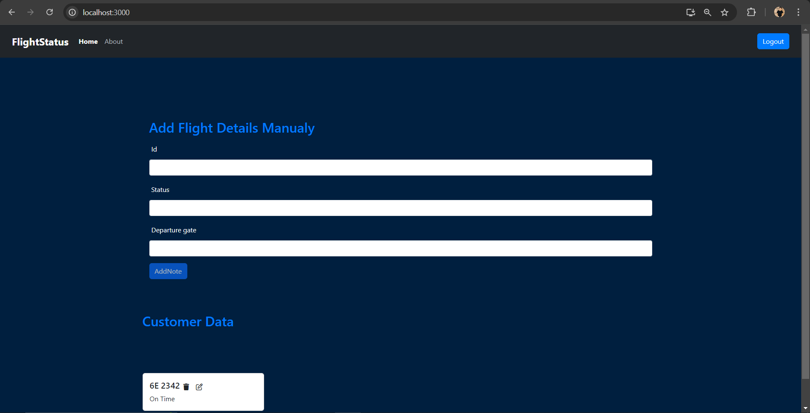
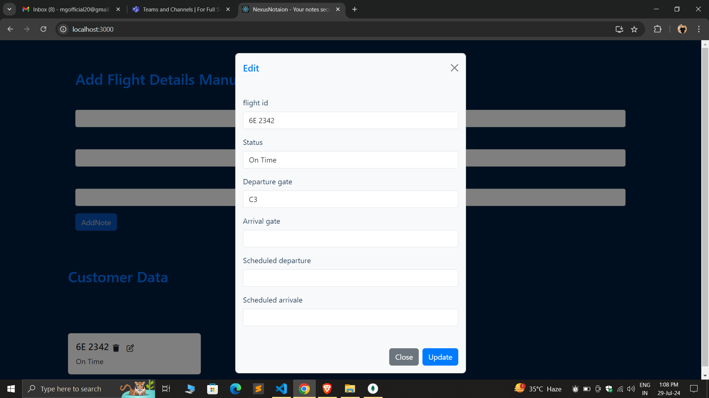
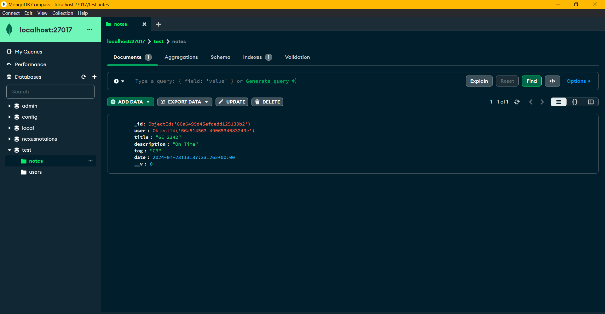
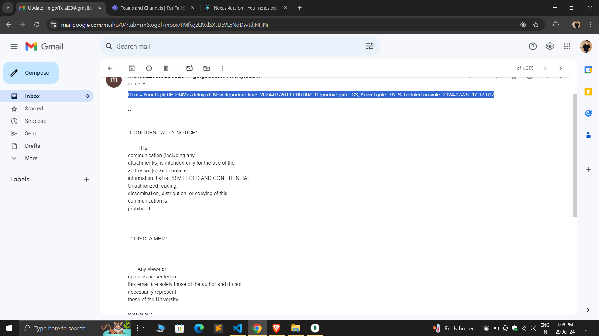

# FlightStatus

## Project Description
FlightStatus is a project that helps users to get real-time updates on flight statuses. This project is built with a Node.js backend and a React frontend.

## Features
- Real-time flight status updates
- Edit Flight Details:** Update existing flight information.
- Email Notification:** Send email notifications upon updating flight details.
- Modern UI

## Technologies Used

- **Frontend:**
  - React.js
  - Bootstrap
  - HTML
  - Css

- **Backend:**
  - Node.js
  - Express.js
  - Mongoose

  **Database**
   - MongoDB
  
  **Notifications**
  - Nodemailer

## ScreenShot
<p align="center">1. The front UI of the Flight Status project features a clean, responsive design that provides admin with an intuitive and accessible way to view and manage flight information.
</p>
<p align="center">2. The update page allows users to easily modify flight details through a user-friendly interface.
</p>
<p align="center">3. The database stores and manages flight information efficiently, ensuring data integrity and quick access.
</p>
<p align="center">The system sends automated email notifications for updates to ensure timely communication.
</p>

## Setup Instructions

### Prerequisites
- Node.js installed
- MongoDB installed and running
- An email account for sending notifications

## Installation

### Prerequisites

- Node.js
- MongoDB

### Steps

1. **Clone the repository:**
    ```bash
    git clone https://github.com/your-username/FlightStatus.git
    ```

2. **Navigate to the project directory:**
    ```bash
    cd FlightStatus
    ```

3. **Install backend dependencies:**
    ```bash
    cd backend
    npm install
    ```

4. **Install frontend dependencies:**
    ```bash
    cd ../frontend
    npm install
    ```

5. **Configure environment variables:** (see [Environment Variables](#environment-variables) section)

## Usage

### Running the Backend

1. **Navigate to the backend directory:**
    ```bash
    cd backend
    ```

2. **Start the backend server:**
    ```bash
    npm start
    ```

### Running the Frontend

1. **Navigate to the frontend directory:**
    ```bash
    cd ../frontend
    ```

2. **Start the frontend server:**
    ```bash
    npm start
    ```

3. **Open your browser and go to `http://localhost:3000`**

## Technologies Used

- **Frontend:**
  - React.js
  - Bootstrap

- **Backend:**
  - Node.js
  - Express.js
  - MongoDB
  - Mongoose
  - Nodemailer

## Environment Variables

Create a `.env` file in both the `backend` and `frontend` directories with the following content:

### Backend `.env` file

```env
MONGO_URI=your_mongodb_connection_string
EMAIL_USER=your_email@gmail.com
EMAIL_PASS=your_email_password